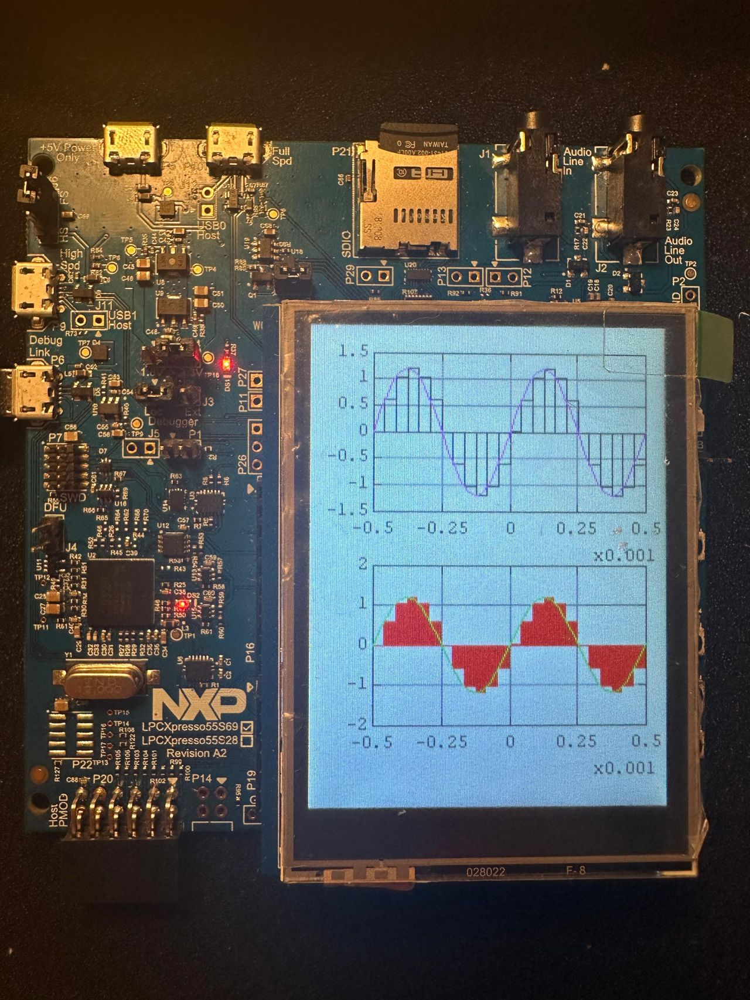
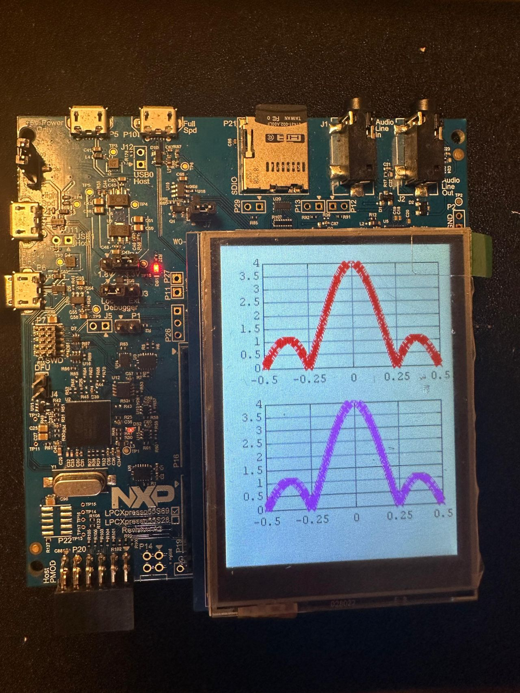
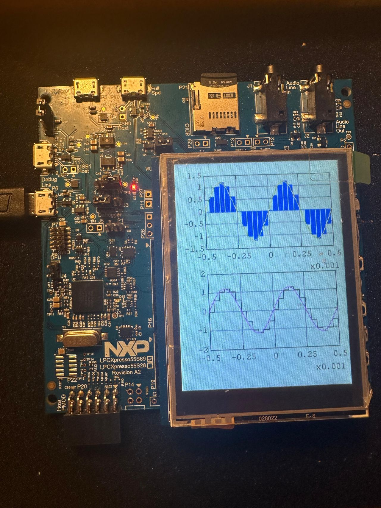
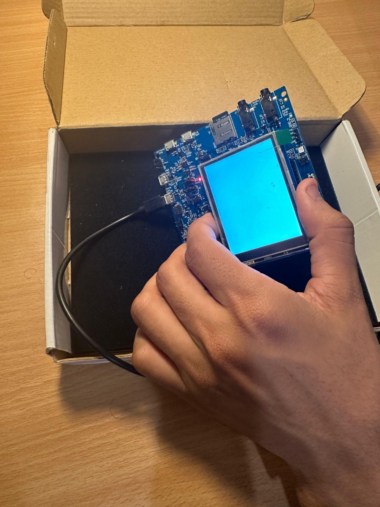
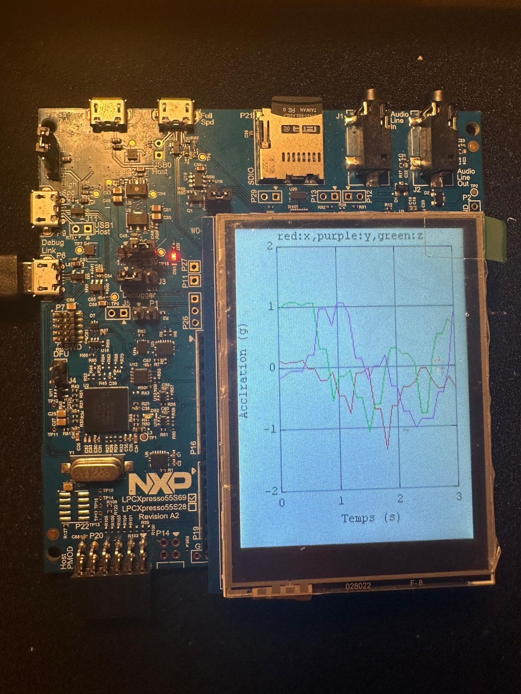
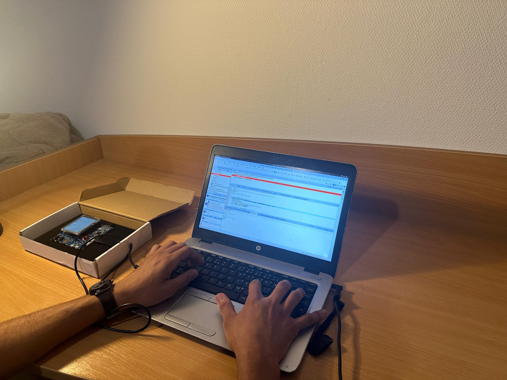
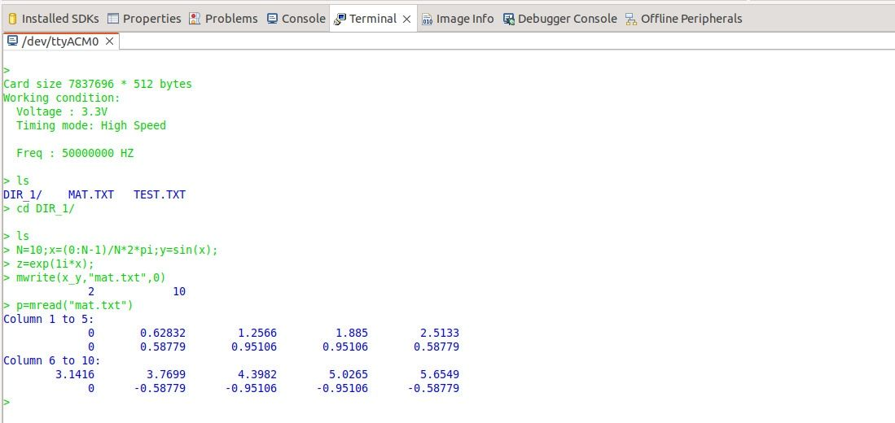
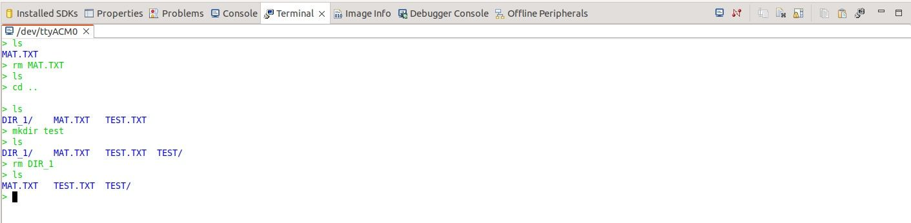
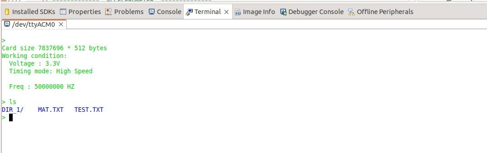
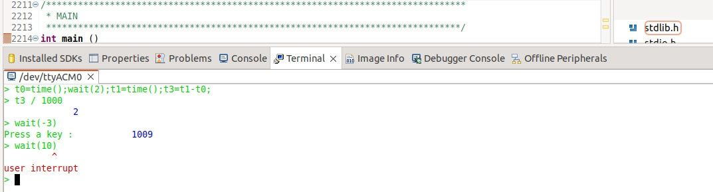

# 🚀 **Projet Microcontrôleur LPCXpresso55S69** 🚀

## **Introduction :**
Ce projet consiste à porter un mini Matlab, initialement conçu pour PC, sur un microcontrôleur **NXP LPC55S69**. Ce portage, bien qu'incomplet, permet de découvrir le fonctionnement des microcontrôleurs **LPC55S69**, et d'explorer des fonctionnalités telles que l'accès à une carte SD, le contrôle d'un écran LCD, le multicore, et l'utilisation du DSP intégré pour le traitement de signal.

## **Détails techniques :**
Le **LPC55S69** intègre deux processeurs **Cortex-M33** et est compatible avec de nombreux périphériques. Voici les composants techniques utilisés :
- **Processeurs** : Dual Cortex-M33 (ARMv8-M)
- **Périphériques** : Carte SD, écran LCD, accéléromètre (MMA86x), PowerQuad (DSP)

## **Objectifs :**
1. **Installation de l’environnement** : Configuration de l'IDE **MCUXpresso** et du **SDK**.
2. **Traitement du signal** : Implémentation du cosinus et de la FFT via **PowerQuad** et traçage sur l’écran LCD.
3. **Multicore** : Activation du second cœur (esclave) via le premier (maître) et gestion de la mémoire partagée.
4. **Accéléromètre** : Récupération et affichage en temps réel des mesures de l'accéléromètre **MMA86x**.

## **Résultats attendus :**
- **Traçage des signaux** en temps réel sur l’écran LCD avec PowerQuad et **CMSIS-DSP**.
- **Multicore** : Communication entre les cœurs maître et esclave et gestion des événements inter-cœurs.
- **Visualisation des données** : Affichage des variations des données de l'accéléromètre en temps réel.

## **Structure du projet :**
- **src/** : Code source du projet
- **docs/** : Documentation du projet (inclure les images ici)
- **images/** : Photos et captures d'écran (ajouter les photos ici)

## **Prérequis :**
- IDE : **MCUXpresso**
- SDK : **LPCXpresso55S69**
- Dépendances : **CMSIS-DSP**, **PowerQuad**

## **Installation :**
1. Cloner ce dépôt : 
   ```bash
   git clone https://github.com/ton_projet_lpc55s69.git
   ```
2. Importer dans **MCUXpresso**.
3. Compiler et téléverser sur la carte **LPC55S69**.

## **Utilisation :**
- Exécuter le programme et observer les signaux tracés sur l’écran LCD.
- Interagir avec le système multicore pour la gestion des événements.

## **Images du projet :**
_Exemple d’affichage des signaux FFT sur l’écran LCD :_













_Configuration du matériel avec la carte LPC55S69 :_

